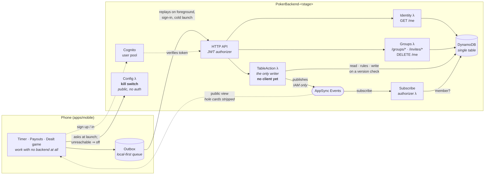
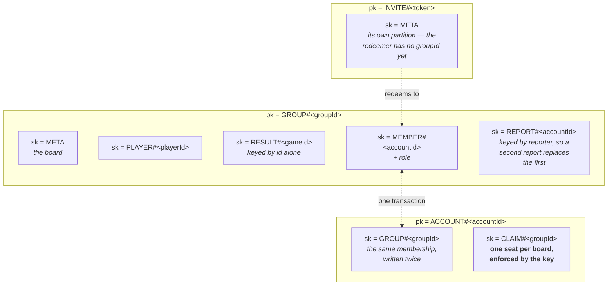

# Architecture

A single monorepo for the **Poker Blinds Buzzer** product: a marketing site with a
full-featured web timer, an iOS/Android app, and the shared logic both build on.

## Overview

| Workspace       | Name            | Stack                                              | Purpose                                                                                                      |
| --------------- | --------------- | -------------------------------------------------- | ------------------------------------------------------------------------------------------------------------ |
| `apps/web`      | `@poker/web`    | Next.js 16 (App Router), React 19, Tailwind CSS 4  | Marketing landing page (`/`) + the full-screen web timer (`/timer`) + privacy policy                         |
| `apps/mobile`   | `@poker/mobile` | Expo SDK 56 (bare), React Native 0.85, expo-router | The iOS/Android app (App Store / Play Store)                                                                 |
| `packages/core` | `@poker/core`   | Plain TypeScript                                   | Framework-agnostic poker logic shared by the apps **and by the backend**                                     |
| `apps/infra`    | `@poker/infra`  | AWS CDK                                            | The backend for accounts, groups and online play. Deployed to a dev environment; nothing in the app calls it |

The web and mobile UIs are **deliberately separate** — desktop and phone have different
needs (the phone manages sleep, background timers, Live Activities and push notifications;
the desktop does not). What they share is **logic, not components**: blind schedules, timer
math, payout and standings maths, serialization, and types all live in `@poker/core`.
Running the React Native UI on the web (`react-native-web`) was evaluated and rejected as
high-effort/fragile for no real desktop benefit.

**`@poker/core` is shared with the server too, and that is the point.** The poker rules run
unchanged in the app and in a Lambda, so a client predicting its own action optimistically is
running literally the same function as the authority that decides it. The two cannot drift, and
there is no second implementation of the rules to keep in step.

## Repository layout

```
apps/
  web/      @poker/web      Next.js site + web timer
  mobile/   @poker/mobile   Expo iOS/Android app (bare workflow: ios/, android/ committed)
  infra/    @poker/infra    AWS CDK stack for accounts and online play (not deployed)
packages/
  core/     @poker/core     shared, framework-agnostic poker logic
```

Inside `packages/core/src`:

```
blinds/       schedule generation, mutation, diffing, formatting
time/         durations, formatting, timer maths
timer/        the timer state machine
storage/      StorageAdapter and one store per feature
payouts/      buy-in and payout structure, and the chop calculator
leaderboard/  players, results, standings, groups and account claiming
poker/        the game engine: cards, hand evaluation, betting, side pots,
              a whole hand, and a whole game
realtime/     the channel names the app and the backend both build from
presets/  reviews/  sounds/  monetization/  share/
```

**The poker engine is a stack of pure reducers.** `cards` deals from an injected random source;
`handValue`/`evaluate` score a hand; `bettingRound` runs one street; `pots` builds and pays side
pots; `table` plays a whole hand; `session` plays hand after hand until somebody has all the chips
and hands the result to the leaderboard. Nothing in it touches a clock, a network or a screen,
which is why it can run on a phone and in a Lambda without changing.

Inside `apps/mobile/src`:

```
app/            expo-router routes: index (timer), settings, blinds, payouts, leaderboard
components/
  ui/           shared primitives (Card, Button, TextField, Sheet, …)
  settings/     the Settings screen, one file per card
  blinds/       the blind-structure editor
  payouts/      the buy-in / payout calculator (Pro)
  leaderboard/  standings, roster, the record-a-game sheet and the group picker (Pro)
  PokerTimer    the timer screen (self-measuring, deliberately bespoke)
theme/          colour / spacing / typography tokens, tablet breakpoint
contexts/       Blinds, Timer, Premium, SoundPack, Payout, Leaderboard, AppState,
                AppReadyGate
```

**Blind levels use a draft/active split.** `BlindsContext` holds `customBlindLevels` (what the
`/blinds` editor mutates) separately from `blindLevels` (what the timer plays); the editor's Apply
button is what promotes one to the other. Applying _clamps_ the current level into the new schedule
rather than resetting it, so editing mid-tournament doesn't restart the game — whereas loading a
preset or resetting to defaults does restart, since those swap in a different tournament entirely.

## Tooling

- **npm workspaces** link the packages. We use npm (not pnpm/yarn) because both original
  repos used npm and because React Native's Metro bundler + Expo autolinking resolve most
  reliably against npm's hoisted `node_modules`.
- **Turborepo** runs and caches tasks across workspaces (`turbo run build|lint|typecheck`).
- **TypeScript**: every package extends `tsconfig.base.json`; cross-package imports use the
  `@poker/core` alias. `@poker/core` ships **uncompiled TypeScript** (its `main`/`types`
  point at `src/index.ts`); Next compiles it via `transpilePackages`, Metro via its
  monorepo config — so there is no separate build step for the shared package.

## The shared seam: `StorageAdapter`

`@poker/core` defines a small async key/value `StorageAdapter` interface and builds every
store on top of it — `createTimerStorage`, `createBlindsStorage`, and the preset, review,
sound-pack, payout and leaderboard stores. Each app supplies its own backend:

|               | Adapter                          | Backend                                               |
| ------------- | -------------------------------- | ----------------------------------------------------- |
| `apps/mobile` | `src/services/storageAdapter.ts` | `@react-native-async-storage/async-storage`           |
| `apps/web`    | `src/lib/storageAdapter.ts`      | `window.localStorage` (SSR-safe no-ops on the server) |

This is what gives the web timer persistence (custom blinds, round length, current level
survive a reload) using the exact same serialization the app uses.

The Pro stores are **mobile-only in practice** — nothing on the web reads payouts or the
leaderboard yet — but they are built on the same seam and gated in the app rather than in
`@poker/core`, so the web timer could adopt them without the maths moving.

## The backend, and what it is not

`apps/infra` is an AWS CDK stack: Cognito for identity, one DynamoDB table, AppSync Events for
realtime, a Lambda that is the only thing allowed to change a poker table, and another behind the
shared leaderboard. **`PokerBackend-prod` is deployed and `backendConfig` points at it as of
1.2.0**, so accounts, shared boards and the sign-up mail behind them are live rather than dead code
behind a flag that never turns on.

**The half the app uses, and the half it does not, are different halves.** This section used to say
that nothing in the app called any of it, and that stopped being true — but it did not stop being
true of everything at once, and the distinction is the thing worth holding on to:

- **Live, and reached by the app**: Cognito sign-up/sign-in and `GET /me`, `GET /config` (the kill
  switch), and the shared leaderboard — `/groups`, `/groups/{groupId}`, the roster and result
  writes the outbox replays, `/invites/{token}`, and `DELETE /me`.
- **Deployed, exercised by hand, and called by nothing**: the poker table.
  `POST /tables/{tableId}/actions`, the AppSync Events channels and the subscribe authorizer are
  all there and all correct, and **the app half was never built** — `sessionTransport` is `null`
  ([`loopbackSessionTransport.ts`](./apps/mobile/src/services/loopbackSessionTransport.ts)), and
  nothing under `apps/mobile` imports `tableChannel` or `playerChannel`. The dealt hold'em game
  that 1.2.0 ships is **local and single-device**: one phone deals and gets passed around the
  table. Online play is a backend waiting for a client.

Some group routes are in the same position on a smaller scale — `/claims`, `/members`, the player
and game deletions and the role changes are deployed and answer correctly, but the app only ever
sends the three additive writes the outbox knows about (`createGroup`, `addPlayer`, `recordGame`),
plus the board reads. See [`groupRequests.ts`](./packages/core/src/sync/groupRequests.ts) for the
exact list.



Everything above the outbox works with no network, including the hold'em game the app deals — that
one is local to a single phone. Only the _shared_ table (one clock and one deal across several
phones) is inherently online, and it is server-authoritative by design, which is the same reason
hole cards are safe. **The dashed `ACT`/`EV`/`SUB` path is the part with no client**: it is drawn
because it exists and is deployed, not because anything calls it.

The single table holds several item types in one keyspace, and that shape _is_ the permission model
— which is the part worth having a picture of:



Four rules are held by the shape rather than by code: one seat per board is a key collision rather
than a check, one report per person per board is the same trick applied to abuse — a second report
replaces the first instead of letting one account fill a partition, membership written under both the group and the account makes "who is here" a
strongly consistent read, and "is there another admin?" is a `ConditionCheck` on a named account
inside the transaction rather than a counter. [`SYNC.md`](./apps/infra/SYNC.md) records the first
schema and why it was replaced — worth reading before changing any of this.

That gap has closed for the leaderboard and not for the table. The board routes are used by a real
phone now — an outbox replaying writes after a bad evening's signal, a merge against local state —
and 1.2.0 is the release that proves it. For the table, what is still only proven is that the
routes answer correctly to a person with `curl`: two people at one table acting at once has never
been exercised by anything but a test.

Two decisions in it are structural rather than incidental:

- **Hole cards are private because of where they are published**, not because the app declines to
  draw them. Each player subscribes to `/table/{tableId}` and to
  `/player/{their own id}/table/{tableId}`, and a subscribe handler rejects a private channel whose
  player segment is not the caller's own. Both sides build those paths from `playerChannel` in
  `@poker/core`, because the app and the backend disagreeing about a path is a _silent_ security
  bug — and was one, until a review caught the guard sitting on a namespace those channels never
  touched.
- **Only the server publishes.** Clients connect and subscribe with their token; publishing is
  IAM-only, so every change to a table goes through the rules once.

The action handler stores and publishes, and both channel namespaces are guarded on subscribe — the
private ones by comparing a path segment to the caller's own subject, the shared one by a Lambda
that reads the table's membership.

The shared leaderboard follows the same instinct in a different shape, and
[`apps/infra/SYNC.md`](./apps/infra/SYNC.md) is the reasoning: **a rule is better as the shape of a
key than as something code has to remember.** One seat per board is `CLAIM#<groupId>`, so a second
claim collides rather than being caught; membership is written under both the group and the account
so "who is here" is a consistent read rather than a race; "is there another admin?" is a condition
on a _named_ account inside the transaction rather than a counter four paths had to maintain. That
document is worth reading before changing any of it, because it also records the first schema and
why it was replaced.

[`apps/infra/README.md`](./apps/infra/README.md) covers observability, environments and deploys, and
`ROADMAP.md` carries what is still open.

## Platform-coupling map

| Concern          | `apps/mobile`                                                                                      | `apps/web`                                                    |
| ---------------- | -------------------------------------------------------------------------------------------------- | ------------------------------------------------------------- |
| Sound            | `expo-audio` (`useSounds`)                                                                         | Web Audio API (`useWebAudio`)                                 |
| Notifications    | `expo-notifications` (`useTimerNotification`)                                                      | `Notification` API + speech synthesis (`useWebNotifications`) |
| Background timer | iOS Live Activities + Android foreground service (`LiveActivityService`, native `ios/`/`android/`) | none — the tab stays open; no background needed               |
| Haptics          | React Native `Vibration` API (`TimerExpirationAlert`) + native Android `Vibrator`                  | none                                                          |
| Storage          | AsyncStorage adapter                                                                               | localStorage adapter                                          |
| UI               | React Native `StyleSheet` components                                                               | Next.js + Tailwind components                                 |

See [CLAUDE.md](./CLAUDE.md) for monorepo conventions and gotchas, and [README.md](./README.md)
for setup, run, and deploy commands.
