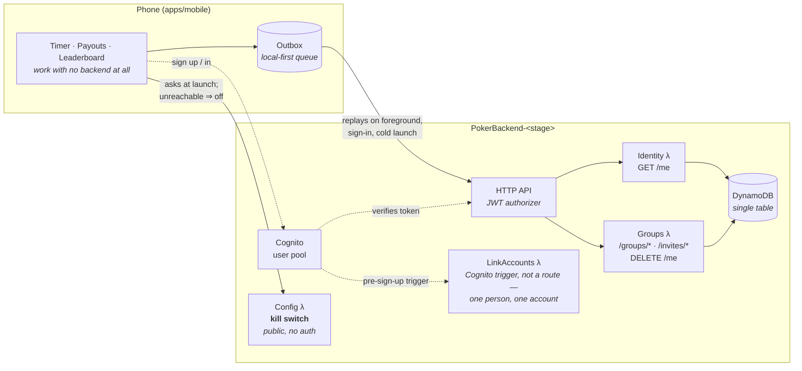
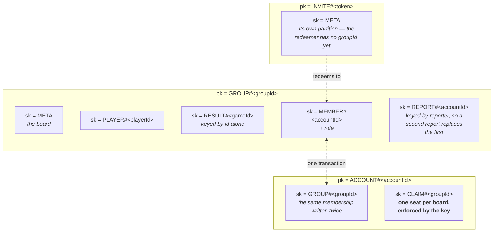

# Architecture

A single monorepo for the **Poker Blinds Buzzer** product: a marketing site with a
full-featured web timer, an iOS/Android app, and the shared logic both build on.

## Overview

| Workspace       | Name            | Stack                                              | Purpose                                                                                                 |
| --------------- | --------------- | -------------------------------------------------- | ------------------------------------------------------------------------------------------------------- |
| `apps/web`      | `@poker/web`    | Next.js 16 (App Router), React 19, Tailwind CSS 4  | Marketing landing page (`/`) + the full-screen web timer (`/timer`) + privacy policy                    |
| `apps/mobile`   | `@poker/mobile` | Expo SDK 56 (bare), React Native 0.85, expo-router | The iOS/Android app (App Store / Play Store)                                                            |
| `packages/core` | `@poker/core`   | Plain TypeScript                                   | Framework-agnostic poker logic shared by the apps **and by the backend**                                |
| `apps/infra`    | `@poker/infra`  | AWS CDK                                            | The backend for accounts, groups and shared boards. Deployed, and everything in it is called by the app |

The web and mobile UIs are **deliberately separate** — desktop and phone have different
needs (the phone manages sleep, background timers, Live Activities and push notifications;
the desktop does not). What they share is **logic, not components**: blind schedules, timer
math, payout and standings maths, serialization, and types all live in `@poker/core`.
Running the React Native UI on the web (`react-native-web`) was evaluated and rejected as
high-effort/fragile for no real desktop benefit.

**`@poker/core` is shared with the server too.** The maths behind a board — what a result is, how
standings are computed, what a queued write turns into — runs unchanged on the phone and in a
Lambda, so there is no second implementation to keep in step.

This used to say more: the _poker rules_ ran in both places, so a client predicting its own action
was running the same function as the authority that decided it. That was true of a server-authoritative
betting engine, and both halves of it are gone — see the Gambling classification section in
[`ROADMAP.md`](./ROADMAP.md#gambling-classification--blocking-120).

## Repository layout

```
apps/
  web/      @poker/web      Next.js site + web timer
  mobile/   @poker/mobile   Expo iOS/Android app (bare workflow: ios/, android/ committed)
  infra/    @poker/infra    AWS CDK stack for accounts and shared boards
packages/
  core/     @poker/core     shared, framework-agnostic poker logic
```

Inside `packages/core/src`:

```
blinds/       schedule generation, mutation, diffing, formatting
time/         durations, formatting, timer maths
timer/        the timer state machine
storage/      StorageAdapter and one store per feature
payouts/      buy-in and payout structure, and the chop calculator
leaderboard/  players, results, standings, groups and account claiming
poker/        the dealer: cards, hand evaluation, a dealt hand, and an
              evening of them. No chips, no betting — see deal.ts
realtime/     the channel names the app and the backend both build from
presets/  reviews/  sounds/  monetization/  share/
```

**The dealer is a stack of pure reducers.** `cards` deals from an injected random source;
`handValue`/`evaluate` score a hand; `deal` runs one hand — shuffle, two cards each, the streets in
order, the showdown; `dealerSession` deals hand after hand with the button moving round. Nothing in
it touches a clock, a network or a screen.

**There are no chips anywhere in it, deliberately.** `bettingRound`, `pots`, and the parts of
`table`/`session` that moved money were removed before 1.2.0 shipped: betting chips is simulated
gambling under Apple's definition even when the chips are worth nothing. The card layer never
depended on the wagering layer, which is why the cut was clean — `cards`, `evaluate` and `handValue`
are untouched. The engine is at the `archive/betting-engine` tag if it is ever wanted.

Inside `apps/mobile/src`:

```
app/            expo-router routes: index (timer), settings, blinds, payouts, leaderboard
components/
  ui/           shared primitives (Card, Button, TextField, Sheet, …)
  settings/     the Settings screen, one file per card
  blinds/       the blind-structure editor
  payouts/      the buy-in / payout calculator (Pro)
  leaderboard/  standings, roster, the record-a-game sheet and the group picker (Pro)
  PokerTimer    the timer screen (self-measuring, deliberately bespoke)
theme/          colour / spacing / typography tokens, tablet breakpoint
contexts/       Blinds, Timer, Premium, SoundPack, Payout, Leaderboard, AppState,
                AppReadyGate
```

**Blind levels use a draft/active split.** `BlindsContext` holds `customBlindLevels` (what the
`/blinds` editor mutates) separately from `blindLevels` (what the timer plays); the editor's Apply
button is what promotes one to the other. Applying _clamps_ the current level into the new schedule
rather than resetting it, so editing mid-tournament doesn't restart the game — whereas loading a
preset or resetting to defaults does restart, since those swap in a different tournament entirely.

## Tooling

- **npm workspaces** link the packages. We use npm (not pnpm/yarn) because both original
  repos used npm and because React Native's Metro bundler + Expo autolinking resolve most
  reliably against npm's hoisted `node_modules`.
- **Turborepo** runs and caches tasks across workspaces (`turbo run build|lint|typecheck`).
- **TypeScript**: every package extends `tsconfig.base.json`; cross-package imports use the
  `@poker/core` alias. `@poker/core` ships **uncompiled TypeScript** (its `main`/`types`
  point at `src/index.ts`); Next compiles it via `transpilePackages`, Metro via its
  monorepo config — so there is no separate build step for the shared package.

## The shared seam: `StorageAdapter`

`@poker/core` defines a small async key/value `StorageAdapter` interface and builds every
store on top of it — `createTimerStorage`, `createBlindsStorage`, and the preset, review,
sound-pack, payout and leaderboard stores. Each app supplies its own backend:

|               | Adapter                          | Backend                                               |
| ------------- | -------------------------------- | ----------------------------------------------------- |
| `apps/mobile` | `src/services/storageAdapter.ts` | `@react-native-async-storage/async-storage`           |
| `apps/web`    | `src/lib/storageAdapter.ts`      | `window.localStorage` (SSR-safe no-ops on the server) |

This is what gives the web timer persistence (custom blinds, round length, current level
survive a reload) using the exact same serialization the app uses.

The Pro stores are **mobile-only in practice** — nothing on the web reads payouts or the
leaderboard yet — but they are built on the same seam and gated in the app rather than in
`@poker/core`, so the web timer could adopt them without the maths moving.

## The backend, and what it is not

`apps/infra` is an AWS CDK stack: Cognito for identity, one DynamoDB table, a Lambda behind
identity and another behind the shared leaderboard. **`PokerBackend-prod` is deployed and
`backendConfig` points at it as of 1.2.0**, so accounts, shared boards and the sign-up mail behind
them are live rather than dead code behind a flag that never turns on.

**Everything deployed is now something the app calls.** That was not true for most of this
project's life: a server-authoritative poker table — `POST /tables/{tableId}/actions`, an AppSync
Events API, two channel namespaces and a subscribe authorizer guarding hole cards — sat deployed
and correct with **no client at all**, because the app half was never built. It was removed before
1.2.0 shipped, along with the betting engine it enforced: wagering chips is simulated gambling
under Apple's definition, which forces an 18+ rating and, on an Individual developer account, may
prevent submission entirely. See the Gambling classification section in
[`ROADMAP.md`](./ROADMAP.md#gambling-classification--blocking-120), and the
`archive/betting-engine` tag for the code.

What the app reaches: Cognito sign-up/sign-in and `GET /me`, `GET /config` (the kill switch), and
the shared leaderboard — `/groups`, `/groups/{groupId}`, the roster and result writes the outbox
replays, `/invites/{token}`, `/groups/{groupId}/report`, and `DELETE /me`.

Some group routes are in the same position on a smaller scale — `/claims`, the player and game
deletions and the role changes are deployed and answer correctly, but nothing in the app sends
them. The outbox knows three additive writes (`createGroup`, `addPlayer`, `recordGame`); see
[`groupRequests.ts`](./packages/core/src/sync/groupRequests.ts) for that list.

**`/members` came off that list in 1.2.0** and this paragraph said otherwise until it was checked.
`leaveBoard` in [`groupApi.ts`](./apps/mobile/src/services/groupApi.ts) sends
`DELETE /groups/{groupId}/members/{accountId}` for the caller's own account — leaving is not an
admin action, so it is the one member route a phone reaches. Removing _somebody else_ still is an
admin action and still has no client. The calls outside the outbox are worth knowing about: it
replays queued writes, and these do not queue.



Everything above the outbox works with no network. What the backend adds is an account, and boards
that other people can see — nothing that has to be online to play a game. **Every box in that
diagram is something the app actually calls**, which it has not been able to say before: the
table-action Lambda, the AppSync Events API and the subscribe authorizer used to sit alongside
these with no client at all, and were removed rather than finished.

The single table holds several item types in one keyspace, and that shape _is_ the permission model
— which is the part worth having a picture of:



Four rules are held by the shape rather than by code: one seat per board is a key collision rather
than a check, one report per person per board is the same trick applied to abuse — a second report
replaces the first instead of letting one account fill a partition, membership written under both the group and the account makes "who is here" a
strongly consistent read, and "is there another admin?" is a `ConditionCheck` on a named account
inside the transaction rather than a counter. [`SYNC.md`](./apps/infra/SYNC.md) records the first
schema and why it was replaced — worth reading before changing any of this.

That gap has closed. The board routes are used by a real phone — an outbox replaying writes after a
bad evening's signal, a merge against local state — and 1.2.0 is the release that proves it. The
table routes never got a client and are gone.

**Two decisions the table backend rested on are worth keeping in writing**, because they were
right, and because anything that replaces it will face them again:

- **Hole cards were private because of where they were published**, not because the app declined to
  draw them. Each player subscribed to `/table/{tableId}` and to
  `/player/{their own id}/table/{tableId}`, and a subscribe handler rejected a private channel whose
  player segment was not the caller's own. Both sides built those paths from one function in
  `@poker/core`, because the app and the backend disagreeing about a path is a _silent_ security
  bug — and was one, until a review caught the guard sitting on a namespace those channels never
  touched.
- **Only the server published.** Clients connected and subscribed with their token; publishing was
  IAM-only, so every change to a table went through the rules once.

Both are at the `archive/betting-engine` tag, along with the authorizer that enforced the first.

The shared leaderboard follows the same instinct in a different shape, and
[`apps/infra/SYNC.md`](./apps/infra/SYNC.md) is the reasoning: **a rule is better as the shape of a
key than as something code has to remember.** One seat per board is `CLAIM#<groupId>`, so a second
claim collides rather than being caught; membership is written under both the group and the account
so "who is here" is a consistent read rather than a race; "is there another admin?" is a condition
on a _named_ account inside the transaction rather than a counter four paths had to maintain. That
document is worth reading before changing any of it, because it also records the first schema and
why it was replaced.

[`apps/infra/README.md`](./apps/infra/README.md) covers observability, environments and deploys, and
`ROADMAP.md` carries what is still open.

## Platform-coupling map

| Concern          | `apps/mobile`                                                                                      | `apps/web`                                                    |
| ---------------- | -------------------------------------------------------------------------------------------------- | ------------------------------------------------------------- |
| Sound            | `expo-audio` (`useSounds`)                                                                         | Web Audio API (`useWebAudio`)                                 |
| Notifications    | `expo-notifications` (`useTimerNotification`)                                                      | `Notification` API + speech synthesis (`useWebNotifications`) |
| Background timer | iOS Live Activities + Android foreground service (`LiveActivityService`, native `ios/`/`android/`) | none — the tab stays open; no background needed               |
| Haptics          | React Native `Vibration` API (`TimerExpirationAlert`) + native Android `Vibrator`                  | none                                                          |
| Storage          | AsyncStorage adapter                                                                               | localStorage adapter                                          |
| UI               | React Native `StyleSheet` components                                                               | Next.js + Tailwind components                                 |

See [CLAUDE.md](./CLAUDE.md) for monorepo conventions and gotchas, and [README.md](./README.md)
for setup, run, and deploy commands.
